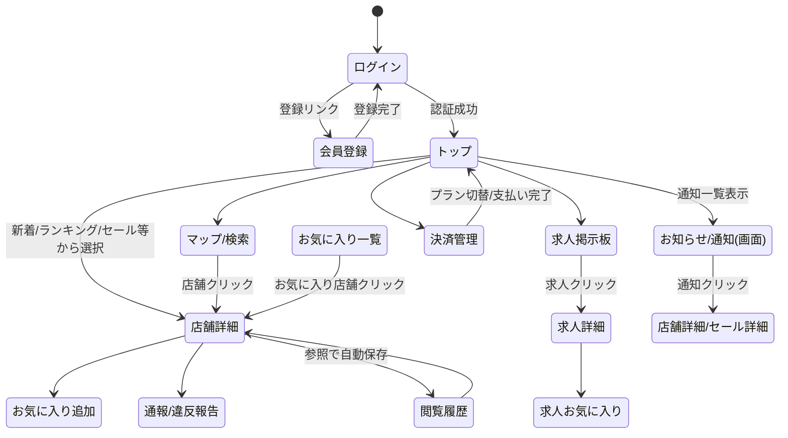
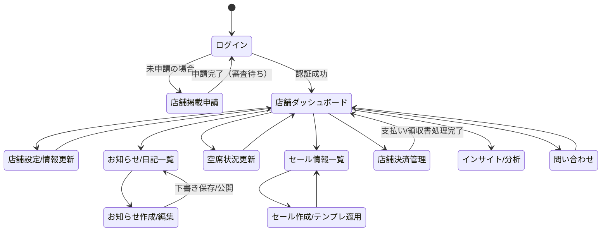
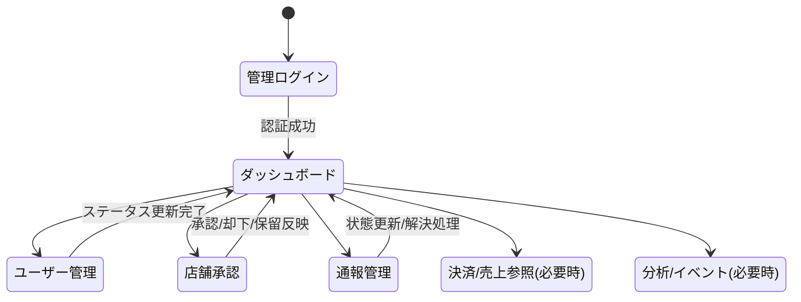

## 画面遷移図（ユーザー/店舗/運営）

作成日: 2026-03-25

本図は `cafe_web` / `cafe_admin` の `app/` 配下のページ構成と、`cafe_api` の機能モジュールを対応付けた概略の遷移図である。

### 1. 一般ユーザー画面遷移

### 2. 店舗（オーナー/スタッフ）画面遷移

### 3. 運営管理者画面遷移

### 4. 画面とAPI（対応の考え方）
Next.js側の画面は、`cafe_api` の以下prefixと概ね対応する。

- ユーザー/閲覧系: `/stores`, `/favorites`, `/jobs`, `/sales`, `/history`, `/notifications`, `/payments`
- 店舗投稿系: `/announcements`, `/sales`, `/stores`（更新）、`/payments`（店舗）
- 運営管理: `/admin`（統計/ユーザー/店舗/通報の管理）

